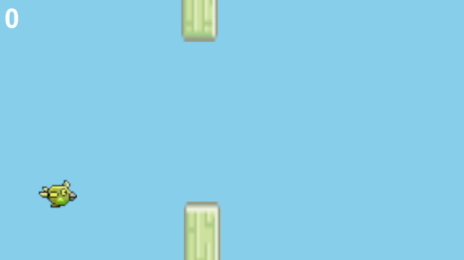
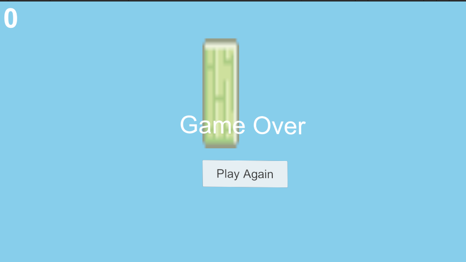

# Spacy Bird (My First Game!)

Welcome! This is my very first game project, made in Unity as a way to learn game development and C#. It's not polished or super good looking, but I had a lot of fun making it and learned a lot along the way.

## About the Game

This game is inspired by the classic Flappy Bird, but with a twist: obstacles can appear not just at the top and bottom, but also in the middle! This makes the game a bit more challenging and different from the original.

## How to Play

- Press the spacebar (or tap/click) to make the bird jump.
- Avoid hitting the obstacles.
- Try to get the highest score you can!

## How to Run

1. Download or clone this repository.
2. Go to the `Game EXE` folder.
3. Run `Flappy-Bird.exe` to start playing. (No installation needed!)

## Screenshots

### Start Menu

### Gameplay

### Game Over

## Credits & Learning

This is my first ever game, made just for fun and to learn about game development and C#. Thanks for checking it out!

---

_Feel free to give feedback or suggestions. I'm still learning and appreciate any help!_
